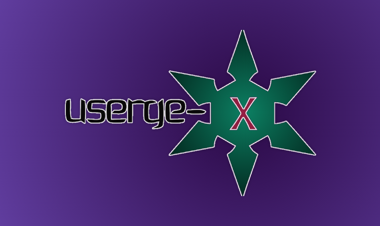

<p align="center">
    <a href="https://github.com/code-rgb/Userge"></a>
    <br>
    <b>Pluggable Telegram UserBot</b>
    <br>
    &nbsp•&nbsp
    <a href="https://github.com/code-rgb/Userge#disclaimer-">Disclaimer</a>
    &nbsp•&nbsp
    <a href="https://github.com/code-rgb/Userge#inspiration-">Inspiration</a>
    &nbsp•&nbsp
    <a href="https://github.com/code-rgb/Userge#features-">Features</a>
    &nbsp•&nbsp
    <a href="https://github.com/code-rgb/Userge#example-plugin-">Example</a>
    &nbsp•&nbsp
    <a href="https://github.com/code-rgb/Userge#requirements-">Requirements</a>
    &nbsp•&nbsp
    <a href="https://github.com/code-rgb/Userge#project-credits-">Project Credits</a>
    &nbsp•&nbsp
    <a href="https://github.com/code-rgb/Userge#copyright--license-">Copyright & License</a>
</p>

# Userge-X 

[](https://travis-ci.com/code-rgb/Userge)             [](https://github.com/UsergeTeam/Userge-Plugins) [](https://t.me/theUserge) [](https://deepsource.io/gh/code-rgb/Userge/?ref=repository-badge)

> **Userge-X** is a Powerful , _Pluggable_ Telegram UserBot written in _Python_ using [Pyrogram](https://github.com/pyrogram/pyrogram).


## Disclaimer

                
   ```

/**
    ⚠️Kang at your own risk⚠️          
    Your Telegram account may get banned.
    I am not responsible for any improper use of this bot
    This bot is intended for the purpose of having fun with memes,
    as well as efficiently managing groups.
    It can help you with managing yourself as well.
    You ended up spamming groups, getting reported left and right,
    and then you ended up in a Final Battle with Telegram
    and at the end the Telegram Team
    deleted your account?
    And after that, you pointed your fingers at us
    for getting your account deleted?
    We will be rolling on the floor laughing at you.
    Yes! you heard it right.
/**
```

## Inspiration 

> This project is inspired by the following projects :)

* [tg_userbot](https://github.com/watzon/tg_userbot) ( heavily ) 
* [PyroGramUserBot](https://github.com/SpEcHiDe/PyroGramUserBot)
* [Telegram-Paperplane](https://github.com/RaphielGang/Telegram-Paperplane)
* [UniBorg](https://github.com/SpEcHiDe/UniBorg)


> Special Thanks to all of you !!!.

## Features 

* Powerful and Very Useful **built-in** Plugins
  * gdrive [ upload / download / etc ] ( Team Drives Supported! ) 
  * zip / tar / unzip / untar / unrar
  * telegram upload / download
  * pmpermit / afk
  * notes / filters
  * split / combine
  * gadmin
  * plugin manager
  * etc...
* Channel & Group log support
* Database support
* Build-in help support
* Easy to Setup & Use
* Easy to add / port Plugins
* Easy to write modules with the modified client

## Example Plugin 

```python
from userge import userge, Message

LOG = userge.getLogger(__name__)  # logger object

CHANNEL = userge.getCLogger(__name__)  # channel logger object

@userge.on_cmd("test", about="help text to this command")  # adding handler and help text to .test command
async def testing(message: Message):
   LOG.info("starting test command...")  # log to console

   await message.edit("testing...", del_in=5)  # this will be automatically deleted after 5 sec

   await CHANNEL.log("testing completed!")  # log to channel
```

## Requirements 

* Python 3.7 or Higher 
* Telegram [API Keys](https://my.telegram.org/apps)
* Google Drive [API Keys](https://console.developers.google.com/)
* MongoDB [Database URL](https://cloud.mongodb.com/)

## How To Deploy 

* **[HEROKU](https://www.heroku.com/) Method** 

  <b>First click the button below.</b> 

  > If you don't have HU_STRING_SESSION just ignore it.  

  > After Deployed to Heroku first turn off the app (resources -> turn off) and run `bash genStr` in console (more -> run console).  

  > After that copy the string session and past it in Config Vars (settings -> reveal config vars). 

  > Finally turn on the app and check the logs (settings -> view logs) :)
<p align="center">
  <a href = "https://heroku.com/deploy?template=https://github.com/code-rgb/Userge/tree/master"></a></p>

* **Other Method** 🔧

  ```bash
  # clone the repo
  git clone https://github.com/code-rgb/Userge.git
  cd Userge

  # create virtualenv
  virtualenv -p /usr/bin/python3 venv
  . ./venv/bin/activate

  # install requirements
  pip install -r requirements.txt

  # Create config.env as given config.env.sample and fill that
  cp config.env.sample config.env

  # get string session and add it to config.env
  bash genStr

  # finally run the Userge ;)
  bash run
  ```

* **[More Detailed Guide](https://docs.google.com/document/d/15uoiOn2NkN518MMkx9h5UaMEWMp8aNZqJocXvS0uI6E)** 

> TODO: add Docker Support.
<br>
<h2>Guide to Upstream Forked Repo</h2>
<a href="https://telegra.ph/Upstream-Userge-Forked-Repo-Guide-07-04"><b>Upstream Forked Repo</b></a>
<br>

### Video Tutorial 

<a href="https://youtu.be/M4T_BJvFqkc"></a>
### Support & Discussions 


> Head over to the [Update Channel](https://t.me/theUserge)

### Project Credits 

* [Specially to these projects](https://github.com/code-rgb/Userge#inspiration-) 
* Team Userge

### Copyright & License 

* Copyright (C) 2020 by [UsergeTeam](https://github.com/UsergeTeam) 
* Licensed under the terms of the [GNU GENERAL PUBLIC LICENSE Version 3, 29 June 2007](https://github.com/code-rgb/Userge/blob/master/LICENSE)

<br>
<p align="center"><b>Userge-X Owner: <a href="https://t.me/deleteduser420">𝚂𝚢𝚗𝚝𝚊𝚡 ░ Σrr♢r</a></b></p>
